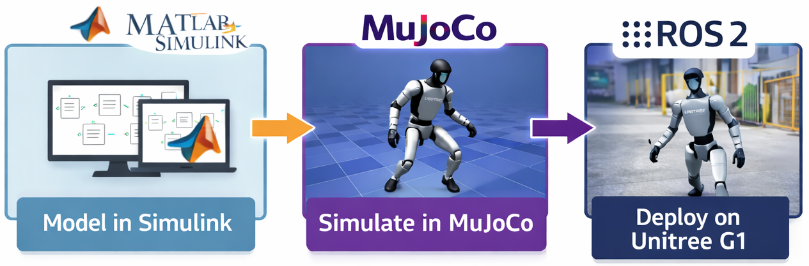
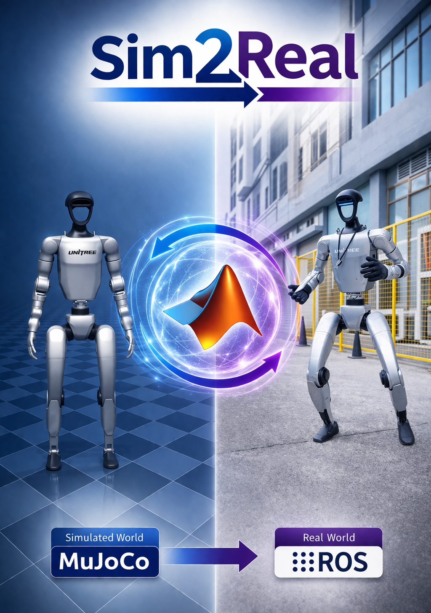

# A MATLAB/Simulink-Based Sim2Real Control Framework for the Unitree G1 Using ROS 2 and MuJoCo

<p align="center">
  
</p>

<p align="center">
  
  
  
  
  
  
</p>

---

## Table of Contents

1. [Introduction](#introduction)
2. [Framework Overview](#framework-overview)
3. [Repository Structure](#repository-structure)
4. [Material Folder Contents](#material-folder-contents)
5. [Technologies Used](#technologies-used)
6. [Getting Started](#getting-started)
7. [How to Use](#how-to-use)
8. [Current Scope](#current-scope)
9. [Future Work](#future-work)
10. [Contact](#contact)
11. [Citation](#citation)
12. [License](#license)
13. [Acknowledgments](#acknowledgments)

---

## Introduction

This repository presents Version 1.0 of a MATLAB/Simulink-based Sim2Real framework for the Unitree G1 humanoid robot, integrating MuJoCo and ROS 2 within a unified workflow for controller development, simulation-based validation, visualization, and real-robot deployment. The main objective of this repository is to provide a clean and research-oriented framework that preserves a common high-level interface across both simulation and real-robot execution backends.

---

## Framework Overview

The core idea of the framework is to allow the user to develop and organize control logic in MATLAB/Simulink, validate it in MuJoCo, and then transition toward ROS 2-based execution on the real Unitree G1 while maintaining a common structure. At the center of the repository is a Sim2Real Variant Subsystem, which enables switching between:

- **MuJoCo:** for simulation-based development and testing
- **ROS 2:** for communication and deployment with the real robot

<p align="center">
  
</p>

This design keeps the overall workflow modular, structured, and reusable.

---

## Representative Example: Ankle Motion

This repository includes a representative ankle-motion example used to validate the Sim2Real workflow in a simple and clear way.

In this example, a standard ankle motion command is first tested in MuJoCo and then executed on the real Unitree G1 through the same framework structure. The goal is to show that the same high-level workflow can be reused across simulation and real-robot execution without changing the overall organization of the framework.

This example serves as a minimal demonstration of the following idea:

- design and organize the task in Simulink
- validate the behavior in MuJoCo
- transfer the same workflow to the real robot through ROS 2

### Example Video

[Watch the Sim2Real ankle motion video](videos/Sim2Real%20ankle%20motion.mp4)

---

## Repository Structure

The repository is organized as follows:

```text

├── images/              # Figures used in the documentation and README
└── material/            # Main technical folder of the project
    ├── examples/        # Example files built on top of the original Sim2Real framework (ankle-motion)
    ├── MuJoCo files/    # MuJoCo simulation resources, XML robot model, meshes, and related files
    ├── ROS 2 files/     # Custom Unitree ROS 2 messages and scripts for message generation/integration
    └── Sim2Real files/  # Core reusable Sim2Real base, Variant Subsystem, and support files
```

---

## Getting Started

This section outlines the required software, toolboxes, platform notes, installation steps, and initial configuration needed to set up the repository and begin using the framework.

### Platform and Compatibility

The framework is intended to be conceptually portable across operating systems. However, at the current stage of development, the workflow has been primarily tested on Windows 11, and this is the recommended environment for reproducing the setup described in this repository.

Additional notes:

- The MuJoCo Simulink Blockset has also been reported as tested on Ubuntu 20.04 and Ubuntu 22.04.
- ROS 2 is generally available on Windows, Linux, and macOS.
- In practice, support on Linux and macOS may be more limited depending on the toolchain, compiler, and integration details.

### Requirements

Before using the framework, make sure the following software is available on your machine:

- MATLAB R2025b
  - This workflow is intended for the desktop version of MATLAB.
  - MATLAB Online is not supported.
- Windows 11
- MuJoCo 3.3.2
- Python 3.9 or 3.10
- Visual Studio 2022 or newer with C++ support
- Visual Studio Code
- Git
- A machine with:
  - A dedicated GPU for smoother MuJoCo simulation
  - A reasonably strong CPU for compilation and simulation tasks
- ROS 2 Jazzy Jalisco
  - This is the ROS 2 distribution used in the current MATLAB / ROS Toolbox workflow.

### Required MATLAB Toolboxes

The following MATLAB products are required for the current workflow:

- Simulink
- Simulink Coder
- MATLAB Coder
- GPU Coder
- ROS Toolbox
- Parallel Computing Toolbox
- Aerospace Toolbox
- Aerospace Blockset

### Optional MATLAB Toolboxes

The following products may be useful for future extensions, but are not mandatory for the current base setup:

- Computer Vision Toolbox
- Robotics System Toolbox
- Control System Toolbox

### Development Tools Setup

#### Visual Studio 2022 or newer

Install Visual Studio with the Desktop development with C++ workload enabled. Inside the installer, make sure the following components are available:

- MSVC C++ compiler tools
- Windows SDK
- C++ build tools

If MATLAB does not detect the compiler correctly after installation, run the following commands in the MATLAB Command Window:

```matlab
mex -setup c++
mex -setup c
```

### MuJoCo Installation

To install the MuJoCo Simulink integration, follow the setup instructions provided in the MuJoCo Simulink Blockset repository included in this project's references. In addition, install the MuJoCo Python package from PowerShell:

```powershell
py -m pip install mujoco
py -m pip show mujoco
```

The second command is useful to verify that MuJoCo was installed correctly in the active Python environment.

### ROS Toolbox Setup

Install ROS Toolbox from the MATLAB Add-On Explorer. If ROS-related features do not work correctly, recreate the Python environment from MATLAB settings and explicitly point it to your local Python installation. A typical path looks like this:

```text
C:\Users\YOUR_USERNAME\AppData\Local\Programs\Python\Python39\python.exe
```

### ROS 2 Custom Messages

This framework uses the `unitree_hg` custom message package for ROS 2 communication. To generate the custom messages:

1. Run:

```matlab
unitree_hg_msgs_creation
```

2. Download the `unitree_hg` folder from the Unitree ROS 2 repository and place it here:

```text
C:\matlab_ros2_custom_msgs\src\unitree_hg
```

3. Then run:

```matlab
generate_custom_msgs
```

> **Note**  
> The exact custom message generation workflow is tied to the contents of the `ROS 2 files` folder in this repository.

### Initial Verification

Before attempting a full run, verify the following:

- MATLAB opens correctly and recognizes the configured C/C++ compiler.
- MuJoCo is installed in Python and visible from the intended environment.
- ROS Toolbox is installed and using the correct Python interpreter.
- The custom `unitree_hg` messages generate without errors.
- The main Simulink framework opens successfully.
- The MuJoCo-related MEX files are compiled and available.

### Recommended Windows Performance Settings

For better simulation performance on Windows, the following settings are recommended:

- Set Windows power mode to Best performance
- In the NVIDIA Control Panel:
  - go to Manage 3D settings
  - set Preferred graphics processor to High-performance NVIDIA processor
  - apply the same preference under Program Settings if needed
- In the MuJoCo Plant block:
  - set FPS to 30
  - disable Depth output
  - disable VSync

---

## How to Use

This section describes the basic execution workflow once the environment has already been configured.

### Basic Workflow

1. Open the main Simulink framework contained in the `Sim2Real files` folder.
2. Select the desired execution backend through the `RUN_MODE` setting inside the framework.
3. After changing the execution mode, press:

```text
Ctrl + D
```

to update the model.
4. Run the framework directly from Simulink.

> **Important**  
> Do **not** rely on an external launcher for the main workflow. The intended procedure is to open the Simulink model and press **Run** from there.

### Run in MuJoCo

To run the framework in simulation:

1. Open the main Simulink model.
2. Set `RUN_MODE` to the MuJoCo backend.
3. Press `Ctrl + D`.
4. Run the model.
5. Use the example files in the `examples` folder as references for minimal demonstrations and extensions.

### Run on the Real Robot

To run the framework on the real Unitree G1 platform:

1. Make sure the robot is in **development mode**.
2. On the robot controller, enter development mode using:

```text
R2 + L2 for 20 seconds
```

3. Confirm that the ROS 2 communication environment is available and that the expected topics are active.
4. Set `RUN_MODE` to the ROS 2 backend in Simulink.
5. Press `Ctrl + D`.
6. Run the model directly from Simulink.

> **Important**  
> When running on the real robot, keep the workflow focused on the active Simulink session. Based on the current setup notes, behavior may become intermittent if the workflow is not kept centered on the Simulink execution tab.

### Robot-Side Networking Note

If communication with the robot does not work correctly, confirm the Ethernet configuration and ROS 2 middleware setup before running the model.

A manual IPv4 configuration may be required. The notes for this setup use an address in the following range:

```text
192.168.123.x
```

where `x` can be replaced with a valid host number, for example:

```text
192.168.123.1
```

A typical Windows navigation path is:

```text
Control Panel
→ Network and Internet
→ Network and Sharing Center
→ Ethernet
→ Properties
→ Internet Protocol Version 4 (TCP/IPv4)
→ Use the following IP address
```

---

## Troubleshooting

This section collects the main setup and runtime issues observed during development, together with their current workarounds.

### MATLAB does not detect the C/C++ compiler

If MATLAB does not properly recognize the installed compiler, run:

```matlab
mex -setup c++
mex -setup c
```

Then restart MATLAB and verify that Visual Studio is selected as the active compiler.

### `mexhost` / `MATLABMexHost.exe` error in `mj_initbus.m`

A possible issue in the MuJoCo blockset setup is a failure related to `mexhost`, where MATLAB cannot launch the isolated external MEX process.

A representative error may mention:

```text
MATLABMexHost.exe
CreateProcessW
The parameter is incorrect [system:87]
```

In this case, a temporary workaround is to edit:

```text
/blocks/mj_initbus.m
```

and replace its behavior with a direct call to the MEX function:

```matlab
function [a,b,c,d,e] = mj_initbus(xmlPath)
% Temporary workaround: bypass mexhost and call MEX directly
[a,b,c,d,e] = mj_initbus_mex(xmlPath);
end
```

This workaround bypasses the external `mexhost` process and calls the MEX directly from MATLAB.

### ROS 2 custom message build fails because `source` already exists

If `generate_custom_msgs.m` fails with an error similar to this:

```text
Error using ros.internal.ROSProjectBuilder
The directory 'C:\Users\USERNAME\source' already exists, will cause the build in directory 'C:\matlab_ros2_custom_msgs\src\matlab_msg_gen\win64' to fail.
Remove or rename 'C:\Users\USERNAME\source', and retry the command.
```

then:

1. Go to your user folder:

```text
C:\Users\YOUR_USERNAME\
```

2. Find the folder named:

```text
source
```

3. Rename it to something like:

```text
source_old
```

Do not delete it if it still contains MuJoCo-related files.

4. If Windows does not allow the rename:
   - close MATLAB, or
   - restart the PC

5. Then run again:

```matlab
generate_custom_msgs
```

### `Undefined C++ MEX function 'mj_initbus_mex'`

If Simulink reports:

```text
Undefined C++ MEX function 'mj_initbus_mex'
```

this may appear after the `source` folder rename or after a broken build state.

In that case, rerun the MuJoCo blockset build scripts:

```matlab
install
setupBuild
build
```

After rebuilding, reopen the model and test again.

### ROS communication instability

If ROS communication behaves unexpectedly:

1. Reset the network connection.
2. Restart the PC.
3. Switch the middleware to:

```text
rmw_cyclonedds_cpp
```

4. Recreate the ROS Toolbox Python environment if necessary.


---

## Technical Notes

This section clarifies a few implementation details that may raise questions when exploring the framework internals.

### Execution Model

The framework is intended to be executed from the main Simulink model. The expected workflow is:

1. open the model
2. choose the backend with `RUN_MODE`
3. update the model with `Ctrl + D`
4. press Run

The current setup notes explicitly recommend not relying on a separate launcher for the main workflow.

### Custom Messages and ROS 2 Integration

The ROS 2 backend depends on the `unitree_hg` custom message package. Message generation is therefore part of the setup process and is not optional for the real-robot communication pipeline.

### Real Robot Operation

When running on the real robot:

- make sure the robot is in development mode
- verify the network configuration
- verify the relevant ROS 2 topics before running
- keep the execution focused on the active Simulink workflow

### Pending Technical Clarifications

The following implementation questions are important and should be documented in more detail in future revisions of the repository:

- Why are there **29** channels in some parts of the framework?
- Why are there **35** channels in other parts?
- Why do **43** channels appear elsewhere?
- Why are hand-related channels present but currently always zero?
- Why are waist roll and waist pitch disabled in the current setup?

These points should be addressed in future technical notes or a dedicated FAQ section once the channel mapping and command structure are fully documented.

---

## Future Work

Planned future developments include:

- Adding more complete examples and demonstrations
- Improving integration with additional sensors and subsystems
- Extending the framework with more advanced humanoid control modules
- State-machine-level monitoring of robot operating modes
- Integration of finger actuation and finger pressure sensing
- Battery and system-status supervision
- Camera and LiDAR integration

---

## Technologies Used

<p align="center">
  
  &nbsp;&nbsp;&nbsp;
  
  &nbsp;&nbsp;&nbsp;
  
  &nbsp;&nbsp;&nbsp;
  
</p>

---

## Contact

Leffer Trochez <br>
Electronic Engineer and M.Sc. in Electronic and Computer Engineering  
Universidad de los Andes  
Faculty of Engineering  
Department of Electrical and Electronic Engineering  
GIAP Research Group  
Bogotá D.C., Colombia  
<p>
  <a href="mailto:l.trochez@uniandes.edu.co"></a>
  &nbsp;
  <a href="https://www.linkedin.com/in/leffer-trochez/"></a>
  &nbsp;
  <a href="https://scholar.google.com/citations?user=Ve1E4AEAAAAJ&hl=es&oi=ao"></a>
  &nbsp;
  <a href="https://orcid.org/0009-0002-5321-7652"></a>
</p>

---

## Citation

If you use this repository in academic work, research projects, technical reports, or derivative software developments, please cite it appropriately.

This repository includes a `CITATION.cff` file in the root of the repository so that GitHub can expose a standard citation format through the Cite this repository feature. Once a public release is archived through Zenodo, this section can be updated with the corresponding DOI-based citation.

### How to cite

Until a DOI is available, the repository can be cited as software in the following format:

```bibtex
@software{trochez2026sim2real,
  author       = {Leffer Trochez and Nicanor Quijano and Jorge Lopez-Jimenez and Carlos Francisco Rodriguez},
  title        = {A MATLAB/Simulink-Based Sim2Real Control Framework for the Unitree G1 Using ROS 2 and MuJoCo},
  year         = {2026},
  version      = {1.0},
  institution  = {Universidad de los Andes},
  url          = {https://github.com/LefferTrochez/Sim2Real-Control-Framework-for-Unitree-G1-Simulink-ROS2-MuJoCo}
}
```

### Citation note

GitHub currently supports citation outputs based on `CITATION.cff`, including APA and BibTeX. If this framework contributes to a thesis, paper, report, or software-based research output, please cite the repository and, once available, its DOI-linked release record.

---

## License

This project is licensed under the Apache License 2.0. See the [LICENSE](LICENSE) file for the full license text.

---

## Acknowledgments

The author would like to express sincere gratitude to [Manoj Vasudevan](https://vmanoj1996.github.io/) for having planted the initial seed of this work through the MuJoCo Simulink Blockset, which provided an important foundation and early inspiration for the development of this framework.

The author also gratefully acknowledges [Álvaro Achury](https://academia.uniandes.edu.co/AcademyCv/au.achury33), leader of the laboratories and caretaker of the humanoid robot platform at Universidad de los Andes (AURA), for his valuable assistance in the handling and operation of the real robot platform.

---

## References

This project builds upon the following software tools, repositories, and official resources:

1. Google DeepMind. *MuJoCo Documentation*. Official documentation website. Available at: https://mujoco.readthedocs.io/

2. Zakka, K., Tassa, Y., and MuJoCo Menagerie Contributors. *MuJoCo Menagerie: A collection of high-quality simulation models for MuJoCo*. GitHub repository, 2022. Available at: https://github.com/google-deepmind/mujoco_menagerie

3. MathWorks. *MATLAB Documentation*. Official documentation website. Available at: https://www.mathworks.com/help/matlab/index.html

4. MathWorks. *Simulink Documentation*. Official documentation website. Available at: https://www.mathworks.com/help/simulink/index.html

5. MathWorks. *ROS Toolbox Documentation*. Official documentation website. Available at: https://www.mathworks.com/help/ros/index.html

6. MathWorks Robotics. *Simulink Blockset for MuJoCo Simulator*. GitHub repository. Available at: https://github.com/mathworks-robotics/mujoco-simulink-blockset

7. Unitree Robotics. *unitree_sdk2*. GitHub repository. Available at: https://github.com/unitreerobotics/unitree_sdk2

8. Unitree Robotics. *unitree_ros2*. GitHub repository. Available at: https://github.com/unitreerobotics/unitree_ros2
